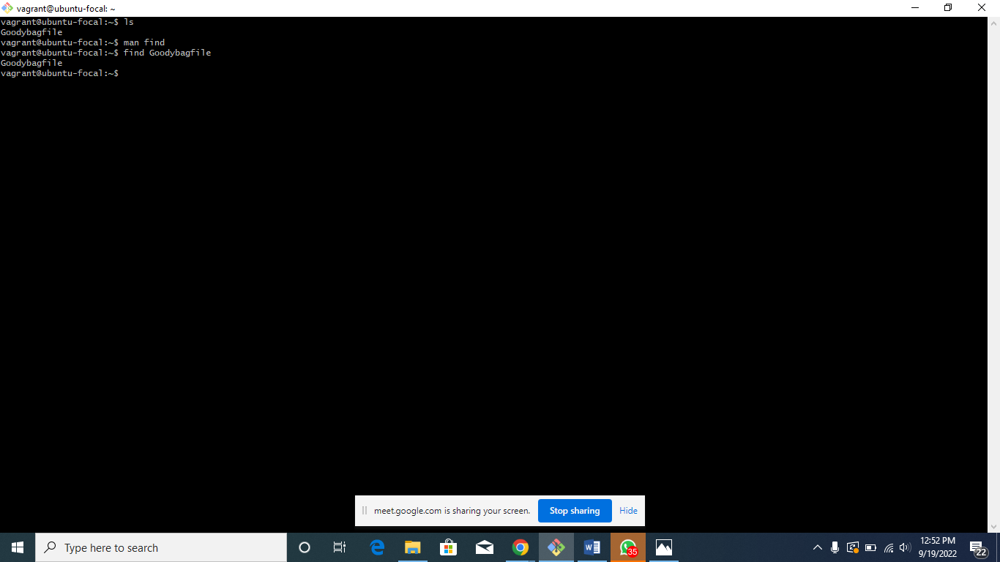
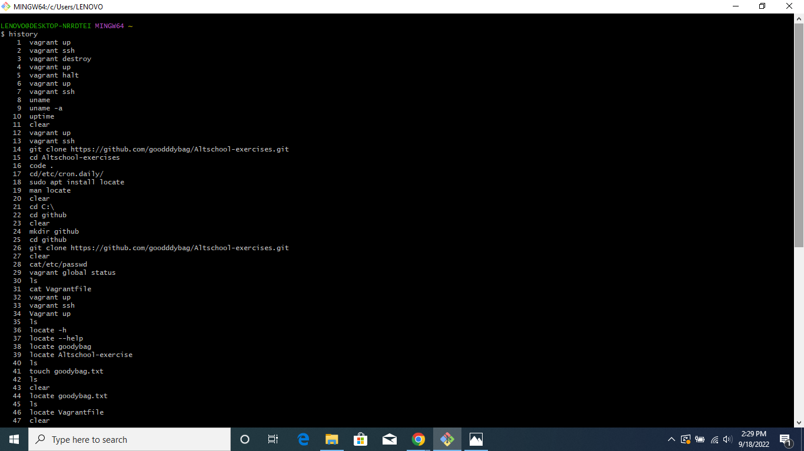
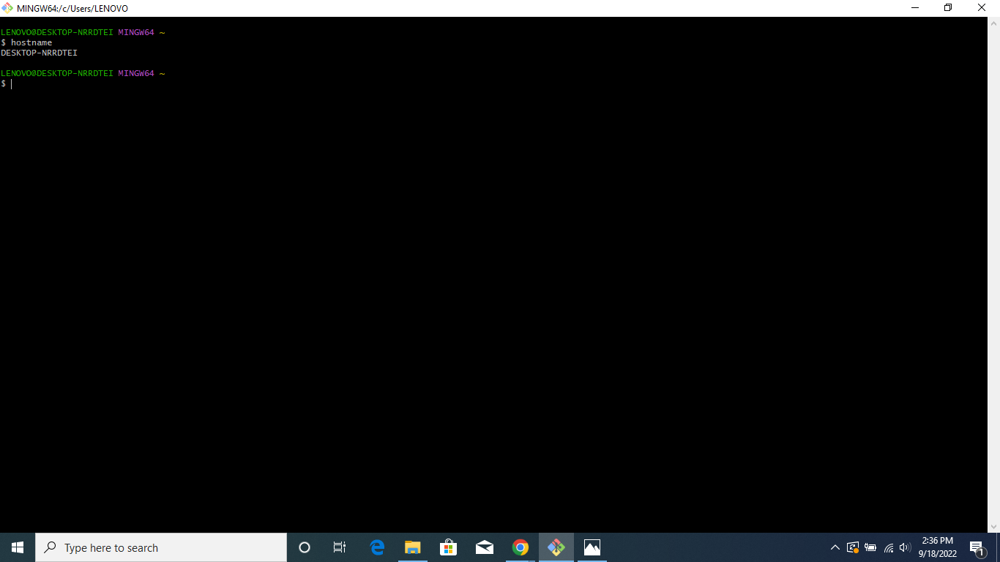
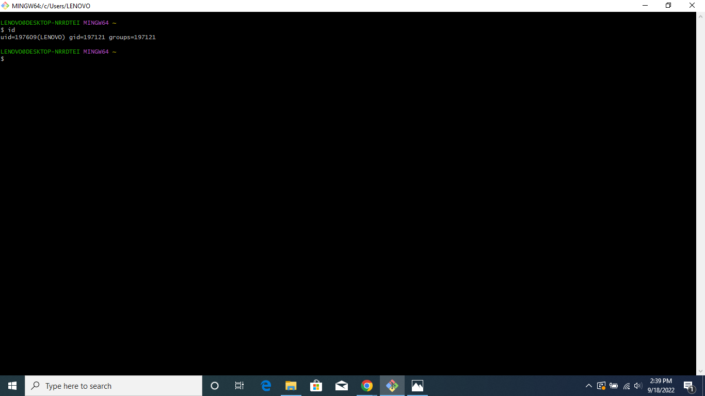
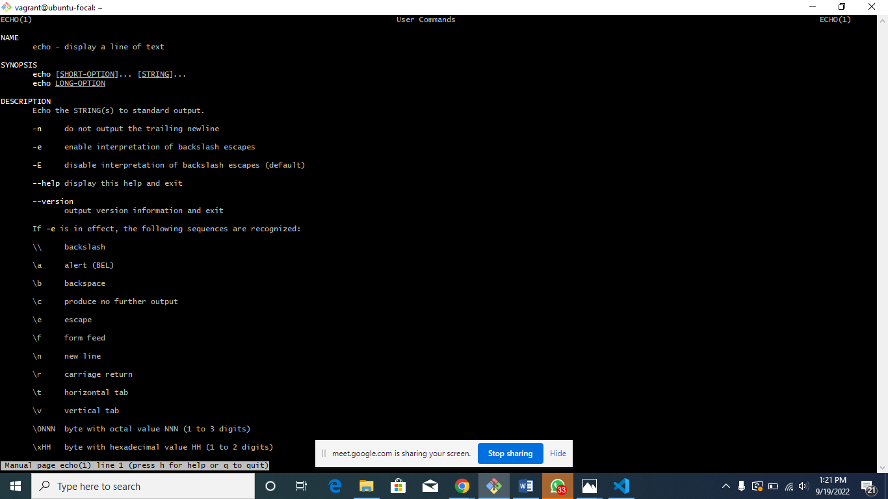
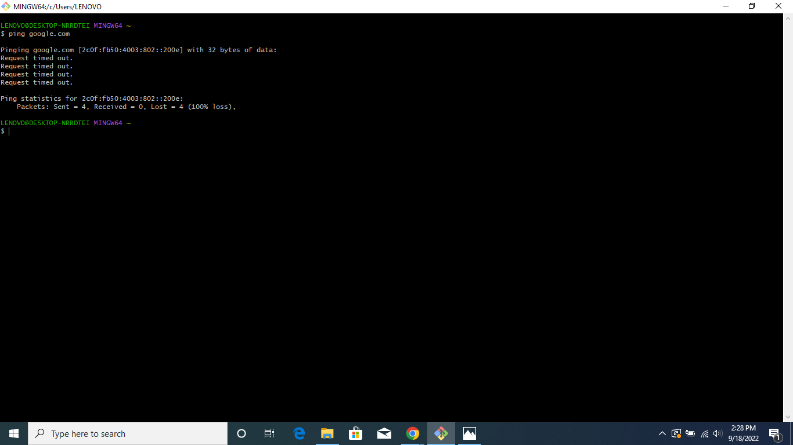
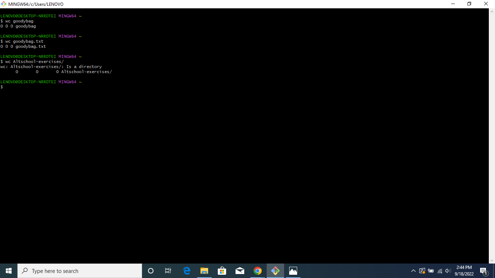

# Exercise 2

Task: Research online for 10 more linux commands aside the ones already mentioned in this module. Submit using your altschool-cloud-exercises project, explaining what each command is used for with examples of how to use each and example screenshots of using each of them.

## Instruction

Submit your work in a folder for this exercise in your altschool-cloud-exercises project. You will need to learn how to embed images in markdown files.

### Answers

#### df -m 
 
 report file system disk space usage

 ##### Example

#### du -h 

estimate file space usage

#### Example

#### find command 

find - search for files in a directory hierarchy

#### Example

#### history command 

 history - GNU History Library

#### Example

##### hostname-command

 hostname - show or set the system's host name

#### Example

#### idcommand

  id - print real and effective user and group IDs

#### Example

#### man-command

  man - an interface to the system reference manuals

#### Example

##### ping-command

 ping - send ICMP ECHO_REQUEST to network hosts

#### Example

#### uname-command

 uname - print system information

#### Example

##### wc-command

 wc - print newline, word, and byte counts for each file

#### Example

