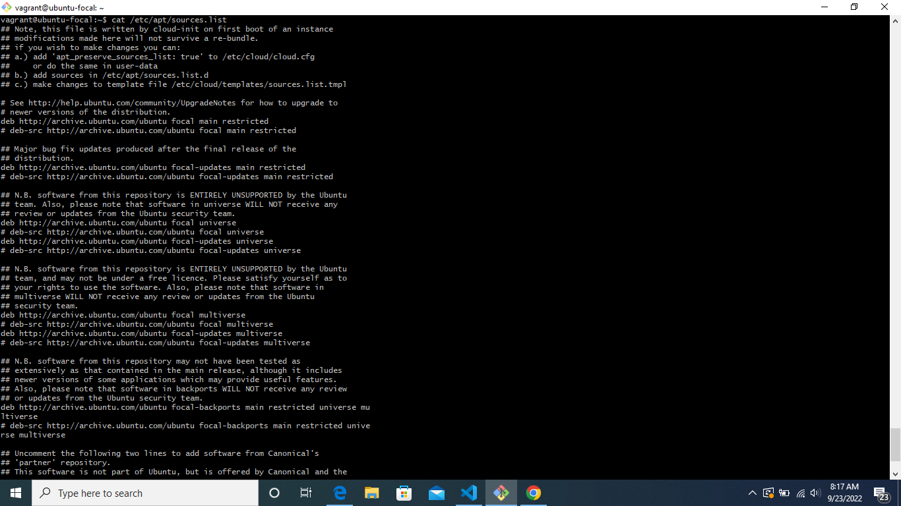

# Exercise 4

Task: Install PHP 7.4 on your local linux machine using the ppa:ondrej/php package repo.

## Instruction

Learn how to use the add-apt-repository command
Submit the content of /etc/apt/sources.list and the output of php -v command.

### Answers

#### Input

sudo apt update

sudo add-apt-repository ppa:ondrej/php package repoV

sudo apt install PHP 7.4

cat /etc/apt/sources.list 

php -v command.

##### Output

/etc/apt/sources.list content

php -v output

